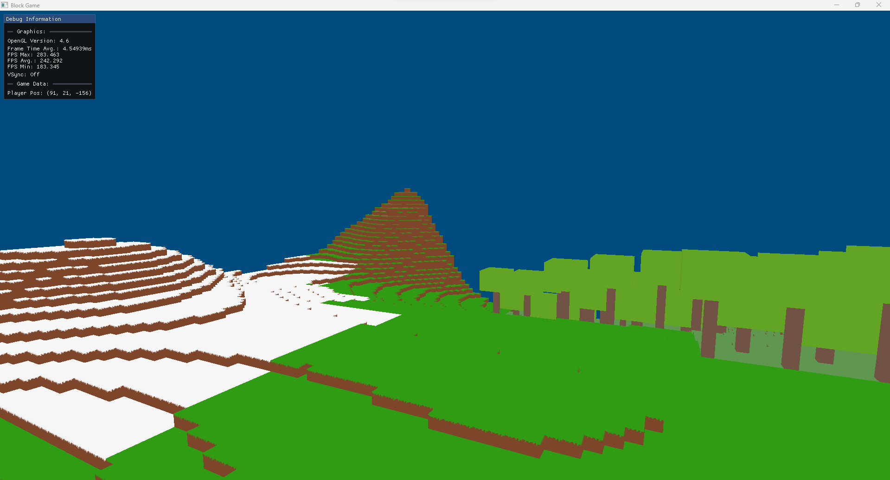

# BlockGame
This is my attempt at making a Minecraft clone using OpenGL and C++. My previous project RemEngine featured infinitely generated  terrain, however it used noise incorrectly and used instancing instead of meshing. This engine uses meshing, where all the visible faces of blocks in a chunk are combined into one mesh and then that mesh is drawn.

As this is still in active development, expect the performance to be sub-optimal, I still have a lot of performance improvements to make. (Loading chunks is much faster in release build mode since vectors have really bad debug build performance.) 

You see a board of planned features here: https://trello.com/b/FBFUMqoR/blockgame

# Current Features

- Infinite terrain (on x and z axis). You can set minimum and maximum y values for terrain to render. For example a minimum y of 0 and maximum y of 3 would result in 3 chunks being used for the height in terrain generation.
- Grassland, Desert, Snow and Forest biomes chosen based on a noise value per chunk that acts as the temperature of the chunk (low temperature creates a snow biome chunk, medium creates grassland, high creates desert). This will be expanded to be more intelligent i.e. take into account other noise-generated paramaters.
- Basic Entity-Component System (Entities have a list of components that store a reference to their owner allowing interaction between components)
- Free-form controller (doesn't have delta time yet so speed depends on frame-rate)
- Seamless terrain with a mix of hills/mountains and flatland.
- ImGui is integrated

# How to Use This Project
This project uses Visual Studio 2022 and has only been tested on Windows.

1. Download the dependencies for this project here: https://drive.google.com/file/d/1XS9ZxI5qlj_9hXGBJIeZJifyONhMKnU3/view?usp=sharing 

2. Copy the dependencies folder into the folder with the Visual Studio Solution. The copied
folder should be named "Libraries" and it should contain several folders.

3. If they aren't already added as an existing file, add:
    - imgui.cpp
    - imgui_draw.cpp
    - imgui_impl_glfw.cpp, imgui_impl_opengl3.cpp
    - imgui_tables.cpp
    - imgui_widgets.cpp
    - stb_image.c
    - glad.c

4. You should now be able to build and run the project
