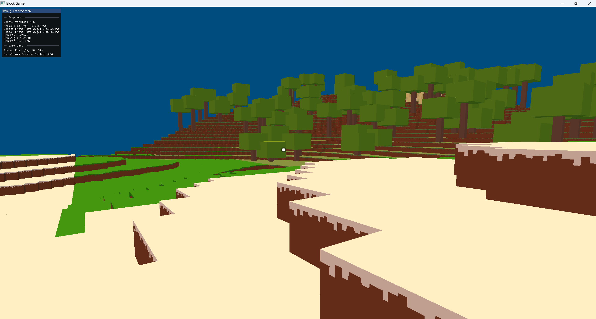

# BlockGame
This is my attempt at making a Minecraft clone using OpenGL and C++. My previous project RemEngine featured infinitely generated  terrain, however it used noise incorrectly and used instancing instead of meshing. This engine uses meshing, where all the visible faces of blocks in a chunk are combined into one mesh and then that mesh is drawn.

Available to download on [Itch.io](https://connorwmackay.itch.io/blockgame)

# Current Features
- Infinite terrain (on x and z axis). You can set minimum and maximum y values for terrain to render. For example a minimum y of 0 and maximum y of 3 would result in 3 chunks being used for the height in terrain generation.
- Grassland, Desert, Snow and Forest biomes chosen based on a noise value per chunk that acts as the temperature of the chunk (low temperature creates a snow biome chunk, medium creates grassland, high creates desert). This will be expanded to be more intelligent i.e. take into account other noise-generated paramaters.
- Basic Entity-Component System (Entities have a list of components that store a reference to their owner allowing interaction between components)
- Free-form controller (doesn't have delta time yet so speed depends on frame-rate)
- Seamless terrain with a mix of hills/mountains and flatland.
- ImGui is integrated
- Directional light (no shadows)
- Player Controller with Collision

# Building
This project uses CMake with FetchContent to fetch the required dependencies. However, the ImGui and Stb Image dependencies still need 
to be manually put into a `Libraries` folder. You can download them [here](https://drive.google.com/drive/folders/1eDN8yw8NPw_SzJ8jSpk-5UMj-r6m_XMQ?usp=sharing).
 
Additionally, you will need to copy the `Assets` folder into the same folder as the executable that gets built.
